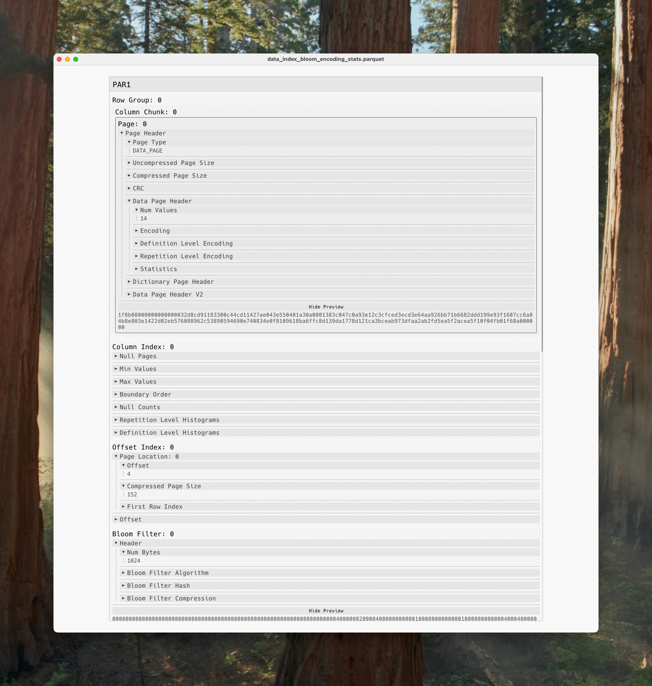
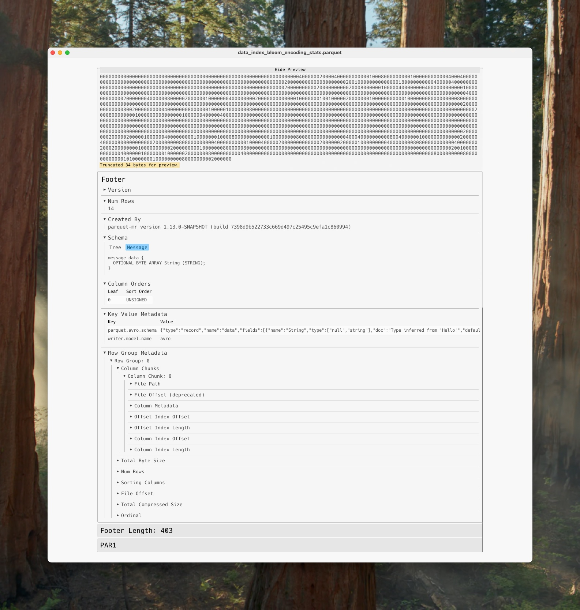

# Parkhay

---

**Parkhay** is an interactive visualization tool for exploring the physical layout of Parquet files. It presents information at the [thrift specification](https://github.com/apache/parquet-format/blob/master/src/main/thrift/parquet.thrift) level, making it ideal for those who need a detailed understanding of the internal file structure. Raw byte-level data can be previewed on demand for non-metadata sections, eg. Column Chunk pages and Bloom filter bitsets.

## Using Parkhay

To run:
`cargo run -- <path/to/file.parquet>`

    

    

## Roadmap

- Support object storage reads via OpenDAL
- Warn when there are regions of the file that are not referenced from the metadata, eg. arbitrary embedded binary content
- Enable export of raw page bytes to a file on-demand
- Display [user-defined indexes](https://datafusion.apache.org/blog/2025/07/14/user-defined-parquet-indexes/) referenced within KeyValue metadata

## Current Limitations

- Files with geospatial types, eg. those in [here](https://github.com/apache/parquet-testing/tree/master/data/geospatial) are not supported
- Encrypted files are not supported
